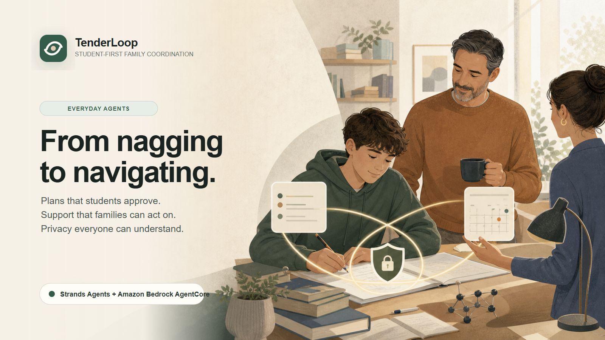

# TenderLoop

**From nagging to navigating.** A caring family coordination agent that helps students study, parents support, and trusted caregivers act—without surveillance.



TenderLoop is our entry for Amazon’s Agents for Humans hackathon, in the **Everyday Agents** track. Its defining boundary is simple: student conversations remain private; only explicit, previewed objects such as study plans, Help Cards, schedule items, and temporary Caregiver Passes cross roles.

## Current implementation

The laptop/desktop web app contains three synthetic perspectives:

- Maya, a 14-year-old student who turns an assignment into a small plan and approves exactly what to share;
- Daniel, a parent who receives a concrete Help Card rather than a transcript or mood score;
- Alex, a temporary caregiver whose logistics-only access expires at 9 PM.

The Student view now calls a server-only `/api/coach` route backed by the official
`@strands-agents/sdk`. The Strands agent is constrained to a validated
`build_study_plan` tool, a three-turn budget, and a student-safety system prompt.
When Bedrock credentials are absent, the same endpoint returns a clearly labelled
deterministic preview so the interface remains testable without pretending an LLM ran.

The family consent loop is interactive end to end: Daniel sees no request before
Maya approves a Help Card, receives only its exact shared text afterward, and can
record a bounded response in a family activity log that excludes Maya's raw chat.

Run it locally:

```bash
npm install
npm run dev
```

Then open `http://localhost:3000`.

Public demo: <https://tenderloop-two.vercel.app>

The public demo supports a production AgentCore path authenticated with short-lived
Vercel OIDC credentials. Until the runtime ARN and least-privilege invocation role
are configured, it runs in clearly labelled deterministic-preview mode. The
repository's real Strands/Nova Lite path has been verified locally against Amazon
Bedrock, and Safe Preview remains the explicit reliability fallback.

To run the real Strands path, configure one of the credential methods supported by
Amazon Bedrock, for example `AWS_BEARER_TOKEN_BEDROCK`, or standard AWS access-key
environment variables with Bedrock model access. Secrets stay server-side and must
not use a `NEXT_PUBLIC_` prefix.

When using a temporary AWS CLI login or another SDK credential provider that does
not expose credential environment variables, set `TENDERLOOP_USE_BEDROCK=true` to
enable the live agent explicitly. The AWS SDK then resolves the temporary credentials
through its normal server-side provider chain.

TenderLoop pins the Bedrock provider to Amazon Nova Lite in Stockholm by default,
avoiding an implicit dependency on an Anthropic model that may not be enabled for
the account. Override it server-side with `AWS_REGION` and `BEDROCK_MODEL_ID` when
needed; for example, `BEDROCK_MODEL_ID=eu.amazon.nova-lite-v1:0` uses the EU
cross-Region inference profile.

## Product and engineering docs

- [Product manifesto](docs/MANIFESTO.md)
- [Architecture and security contract](docs/ARCHITECTURE.md)
- [Devpost media package](media/MEDIA_PLAN.md)

## AWS roadmap

The Strands Student Coach and its AgentCore Runtime adapter are implemented. See
[`agentcore-runtime/DEPLOYMENT.md`](agentcore-runtime/DEPLOYMENT.md) for the
least-privilege deployment and Vercel OIDC integration runbook. The language model
proposes; deterministic policy and explicit human approval govern consequential
actions.

All demo data is synthetic. TenderLoop is an AI support tool—not a parent, therapist, diagnostician, or disciplinarian.

Student wellbeing is handled as private, functional study accommodations and human handoffs—not diagnosis, symptom assessment, treatment advice, or mood surveillance. See the health and wellbeing boundary in the [product manifesto](docs/MANIFESTO.md).

## License

MIT
