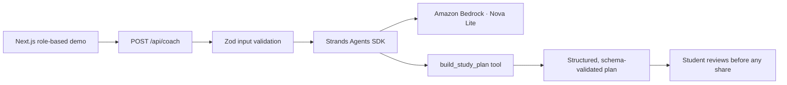

# TenderLoop architecture

## Implemented and verified prototype

The current repository implements a bounded Student Coach flow:

The interactive experience includes three deliberately different scopes:

- Maya receives a private planning workspace. The agent can draft a study plan, but it cannot publish a Help Card.
- Daniel sees only the exact Help Card Maya approves and shared family schedule information.
- Alex receives a synthetic, expiring logistics view with no access to study history or private conversation.

The route handler validates `assignment`, `difficulty`, and `comfort`, invokes a Strands JavaScript agent configured with an explicit Bedrock model, and accepts output only through the typed `build_study_plan` tool and final structured-output schema.

Local development uses the authenticated AWS CLI provider chain with `amazon.nova-lite-v1:0` in `eu-north-1`. The Vercel deployment intentionally has no AWS credentials and therefore uses the deterministic safe-preview response. The UI labels the active mode as either **Strands agent** or **Safe preview**.

## Current privacy boundary

- Synthetic family, assignment, schedule, and caregiver data only.
- No login, durable database, analytics, or private conversation persistence.
- Help Card text is previewed verbatim before the simulated share action.
- Role changes alter only client-side demo state.
- The agent has one narrow tool and no capability to message, schedule, purchase, or mutate an external system.

## Production hardening roadmap — not implemented in this prototype

A production TenderLoop would add verified identity and family membership, deterministic authorization, durable consent receipts, audited idempotent tools, encrypted family-scoped storage, revocable caregiver passes, and reviewed safety escalation. Candidate AWS services include Cognito, API Gateway, Lambda, Cedar/Verified Permissions, DynamoDB, EventBridge, Bedrock Guardrails, CloudWatch, and AgentCore.

These services are architectural direction only. They are not claimed as part of the submitted implementation or **Built With** list.
