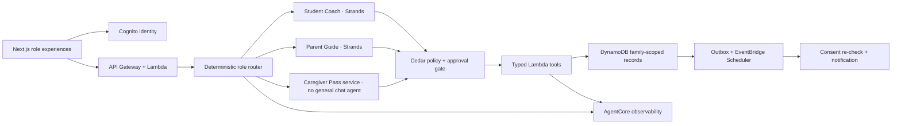

# TenderLoop architecture

## System shape

TenderLoop uses two bounded language-model roles and one deterministic caregiver experience:



AgentCore Runtime hosts a single Python service with separate Student Coach and Parent Guide prompts and tool allowlists. The agents never exchange free-form conversation. A child-approved, stored Help Card is the only cross-role study handoff.

## Authorization contract

The server resolves identity and role from a verified JWT. It never trusts a role, family identifier, or student identifier supplied in a prompt. Every mutation verifies authenticated subject, active family membership, server-resolved role, family ownership of the resource, operation scope, unexpired consent or Caregiver Pass, approval hash and object version, and an idempotency key.

The model can draft a plan, Help Card, replan, reminder, or parent response. It cannot approve its own proposal.

## Principal tool contracts

Student tools: `get_student_day`, `draft_study_plan`, `approve_study_plan`, `mark_session_status`, `replan_missed_session`, `draft_help_card`, `publish_help_card`, `propose_reminder`, `approve_reminder`, and `save_preference_card`.

Parent tools: `get_shared_family_view` and `respond_to_help_card`.

Caregiver tools: `get_caregiver_day`, `acknowledge_handoff`, `report_exception`, and `request_parent_decision`.

All mutating requests include `request_id`, `idempotency_key`, and `expected_version`. Consequential tools write the state change, approval receipt, audit metadata, and outbox event atomically.

## Data and memory

A DynamoDB single table uses family-scoped partition keys and records for Family, Membership, Assignment, Plan, StudySession, HelpCard, PreferenceCard, Approval, Reminder, CaregiverPass, AuditEvent, and IdempotencyResult. Reverse membership and hashed invite lookup use secondary indexes.

Raw student chats are ephemeral. AgentCore Memory is short-term only for minor conversations. A durable PreferenceCard is created only after an explicit, child-visible save action and remains editable and deletable.

## Caregiver Pass

The pass begins as a 256-bit opaque single-use invite. Only its hash is stored. After authentication it binds to one subject, family, student, time window, and narrow scope. The default duration is 24 hours and the maximum is seven days. It is visible to the student and parent, revocable, non-transferable, and cannot extend itself.

## Safety layers

- deterministic input and action policy;
- Amazon Bedrock Guardrails;
- PII masking or blocking on model input and output;
- academic-integrity checker;
- typed Pydantic schemas;
- Cedar authorization;
- Lambda-side reauthorization;
- output validation and audit metadata;
- specialist-reviewed crisis and trusted-adult handoff policy.

Guardrails do not replace authorization and cannot be assumed to inspect every tool argument.

## Repository evolution

The hackathon starts with a Next.js demonstration at the repository root. The production-oriented shape will grow into:

```text
src/                    Next.js experience and local adapters
services/agent/         Python Strands + AgentCore runtime
services/tools/         typed Lambda tool implementations
packages/contracts/     shared schemas and generated clients
infra/                  AWS CDK stacks and Cedar policies
tests/e2e/              family journey tests
tests/redteam/          privacy, role, injection, and safety tests
agentcore/               runtime configuration
```

Local mode uses synthetic assignments and the Maya/Daniel/Alex family profile. No real child, school, health, or location data is required for the demonstration.
